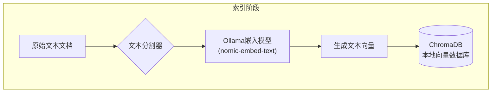
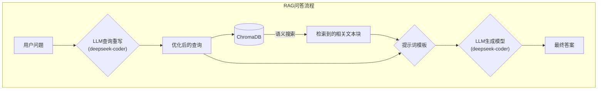

# 本地化智能RAG系统 (Local RAG System with Ollama)

这是一个完全在本地环境运行的、基于Ollama的检索增强生成（Retrieval-Augmented Generation, RAG）系统。它利用本地部署的大型语言模型（LLM）和嵌入模型，实现了从文档处理、知识库构建到智能问答的全流程，确保了数据的绝对隐私和零API调用成本。

## ✨ 功能特性

-   **🚀 完全本地化**: 所有组件（LLM、嵌入模型、向量数据库）均在本地运行，无需互联网连接或API密钥。
-   **🧠 Ollama强力驱动**: 无缝集成Ollama，可轻松切换和使用社区中各种强大的开源模型。
-   **💾 持久化知识库**: 使用 [ChromaDB](https://www.trychroma.com/) 作为本地向量数据库，一次构建，持久使用，快速检索。
-   **🔍 LLM查询重写**: 在检索前，使用LLM优化和重写用户问题，将其转换为更适合语义搜索的查询，显著提升检索相关性。
-   **🔗 模块化设计**: 基于 [LangChain](https://www.langchain.com/) 框架构建，代码结构清晰，易于扩展和维护。
-   **🔐 隐私安全**: 敏感文档和查询数据永远不会离开您的本地机器。

## ⚙️ 系统架构与工作原理

本系统主要包含两个核心阶段：**知识库构建（Indexing）** 和 **问答流程（Querying）**。

### 1. 知识库构建流程

这个阶段是将您的原始文档处理并存入向量数据库的过程，通常在新文档加入时执行一次。



1.  **文本分割**: 将长文档切分成大小适中、有意义的文本块（Chunks）。
2.  **向量化 (Embedding)**: 调用Ollama中的嵌入模型（如 `nomic-embed-text`），将每个文本块转换成能够代表其语义的向量。
3.  **存储**: 将文本块及其对应的向量一同存入本地的ChromaDB数据库中，并持久化到磁盘。

### 2. 问答流程

当用户提出问题时，系统会执行以下实时流程来生成答案：


1.  **查询重写**: 首先将用户的原始问题发送给一个LLM（如 `deepseek-coder`），让它将口语化、模糊的问题改写成更清晰、关键词更明确的检索查询。
2.  **语义检索**: 使用嵌入模型将优化后的查询也转换为一个向量，然后在ChromaDB中进行相似度搜索，找出与查询向量最匹配的几个文本块。
3.  **构建上下文**: 将检索到的文本块内容和用户的原始问题，一起填入一个预设的提示词（Prompt）模板中。
4.  **生成答案**: 将构建好的提示词发送给LLM，模型会基于提供的上下文信息，生成一个精准、有依据的答案。

## 🚀 开始使用

请按照以下步骤在您的本地环境中设置并运行本项目。

### 1. 先决条件

-   [Git](https://git-scm.com/downloads)
-   [Python 3.8+](https://www.python.org/downloads/)
-   [Ollama](https://ollama.com/) 已安装并正在后台运行。

### 2. 环境设置

1.  **克隆仓库**
    ```bash
    git clone https://github.com/Xiaobaichipi/smart-rag-system.git
    cd smart-rag-system
    ```

2.  **下载Ollama模型**
    本项目默认使用两个模型，请通过Ollama拉取它们：
    ```bash
    # 用于生成答案和查询重写的模型
    ollama pull deepseek-coder:6.7b

    # 用于文本向量化的嵌入模型
    ollama pull nomic-embed-text
    ```
    *您也可以在 `smart_chunker_v3.py` 文件中修改 `llm_model` 和 `embedding_model` 参数来使用您喜欢的其他模型。*

3.  **安装Python依赖**
    建议创建一个虚拟环境。
    ```bash
    # 创建虚拟环境 (可选)
    python -m venv venv
    source venv/bin/activate  # 在Windows上使用 `venv\Scripts\activate`

    # 安装依赖
    pip install langchain langchain-community chromadb numpy
    ```

### 3. 运行项目

直接运行主脚本即可：

```bash
python smart_chunker_v3.py
```

-   **首次运行**: 程序会检测到知识库不存在，并使用示例数据自动进行构建。这个过程可能需要一些时间，因为它需要调用嵌入模型处理文本。
-   **后续运行**: 程序会直接加载已存在的本地知识库，并直接进入问答环节。

### 示例输出

```
...
检测到已存在的本地知识库，直接加载。

--- 开始执行RAG流程 ---
原始查询: 深度学习在哪些方面很成功？
重写查询: 深度学习在哪些具体领域或应用中取得了显著的成功和突破？
正在检索相关信息并生成答案...
--- RAG流程结束 ---

============================================================
用户问题: 深度学习在哪些方面很成功？
使用的检索查询: 深度学习在哪些具体领域或应用中取得了显著的成功和突破？

生成的答案:
根据提供的文档，深度学习在以下领域取得了革命性的成功：
1.  **图像识别**
2.  **自然语言处理（NLP）**
3.  **语音识别**

它通过利用深度神经网络来处理数据，在这些方面表现出色。

--------------------
检索到的相关上下文片段:
片段 1:
深度学习是机器学习的一个特定子领域，它利用深度神经网络（具有许多层的网络）来处理数据。它在图像识别、自然语言处理和语音识别等领域取得了革命性的成功。
...
============================================================
```

## 🗺️ 未来规划与改进方向

-   [ ] **高级语义切分**: 重新引入最初的设想，使用LLM分析文档结构，实现比固定长度切分更智能、更符合语义边界的文本块切分。
-   [ ] **引入重排器 (Re-ranker)**: 在检索（Retrieve）和生成（Generate）之间增加一个重排步骤。让LLM对初步检索到的文档块与查询的相关性进行打分排序，筛选出最优质的上下文信息送入最后一步，进一步提升答案的准确性。
-   [ ] **Web界面**: 使用 `Streamlit` 或 `Gradio` 为系统创建一个简单的Web交互界面，方便非技术人员使用。
-   [ ] **知识库管理**: 增加添加、删除、更新知识库中文档的功能。

---
